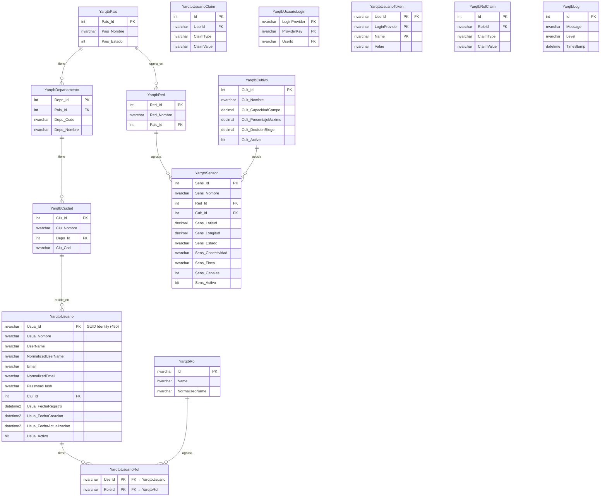

# Diagrama ER — Yarqua (`dbYarqua`)

Modelo actual de la base de datos (nomenclatura `Yarqtb*`).
Desde la migración a ASP.NET Core Identity, `YarqtbUsuario` usa `nvarchar(450)` como PK (GUID de Identity).

## Diagrama

## Explicación

### Geografía
- **YarqtbPais**: catálogo de países (Colombia, Ecuador, Honduras).
- **YarqtbDepartamento**: provincias/departamentos; pertenece a un país (`Pais_Id`).
- **YarqtbCiudad**: municipios/cantones; pertenece solo al departamento (`Depo_Id`). El país se obtiene vía Departamento → País.

### Usuarios e Identity
- **YarqtbUsuario**: usuario de la app; mapeado a `ApplicationUser : IdentityUser`. La PK `Usua_Id` es un GUID `nvarchar(450)` generado por Identity. Su ubicación es la ciudad (`Ciu_Id`).
- **YarqtbRol / YarqtbUsuarioRol**: roles Identity (`Admin`, `User`). Sembrados al inicio en `Program.cs`.
- **YarqtbUsuarioClaim / YarqtbUsuarioLogin / YarqtbUsuarioToken / YarqtbRolClaim**: tablas auxiliares de Identity.

### Sensores y riego
- **YarqtbRed**: red de sensores ligada a un país (p. ej. RED ASORUT, RED ECUADOR, RED HONDURA).
- **YarqtbCultivo**: parámetros de riego (capacidad de campo, % máximo, % decisión).
- **YarqtbSensor**: nodo/sensor; pertenece a una red y opcionalmente a un cultivo; guarda coordenadas, estado y conectividad.

### Soporte
- **YarqtbLog**: logs de aplicación (Serilog).

### Relaciones (FK)
| Desde | Hacia | Columna |
|-------|-------|---------|
| Departamento | País | `Pais_Id` |
| Ciudad | Departamento | `Depo_Id` |
| Usuario | Ciudad | `Ciu_Id` |
| UsuarioRol | Usuario | `UserId` |
| UsuarioRol | Rol | `RoleId` |
| Red | País | `Pais_Id` |
| Sensor | Red | `Red_Id` |
| Sensor | Cultivo | `Cult_Id` (nullable) |
